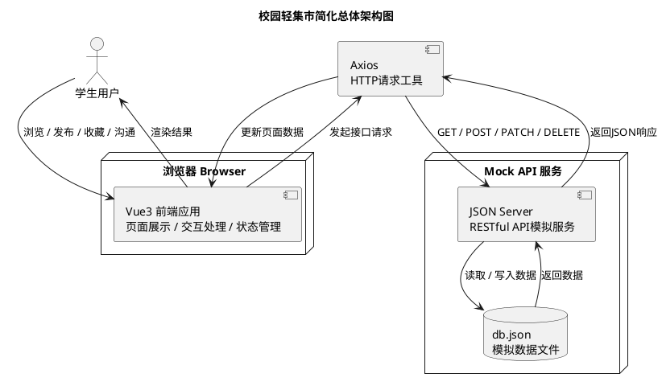

到此为止，我们已经完成了以下任务：  
第一，实训方案已经明确项目定位是“AI辅助下的前端工程实践”；

第二，需求分析已经把四类业务场景、用户故事、数据资源和功能边界梳理清楚；

下面，正式进入“技术架构”


## **一、架构定位**
“校园轻集市”是一个面向大学生前端实训的教学型项目。它不是简单的静态前端页面，也不是包含真实后端、数据库、权限系统和部署运维的完整全栈项目，而是一个以前端应用为主体、引入 Mock API 服务、具备前后端分离开发形态的前端工程实践项目。

从 Web 应用开发技术层次来看，本项目处于“前端 + Mock API”阶段，适合作为学生从纯前端页面开发过渡到真实前后端分离开发之前的综合实训项目。

Web 应用开发可以大致分为以下几个层次：

| **层次** | **技术形态** | **典型技术** | **说明** |
| --- | --- | --- | --- |
| Level 1 | 纯前端页面 | Vue、Pinia、localStorage | 数据主要写在前端代码或浏览器本地存储中 |
| Level 2 | 前端 + Mock API | Vue、Axios、JSON Server | 前端通过 HTTP 接口访问 Mock API，本项目属于该层次 |
| Level 3 | 前后端分离 | Vue、Axios、Spring Boot/FastAPI、MySQL | 具备真实接口、业务逻辑和数据库 |
| Level 4 | 完整全栈系统 | 前端、后端、数据库、Redis、Linux、Docker、Nginx | 涉及完整开发、部署和运维流程 |


本项目选择 Level 2 的技术形态，主要基于以下考虑：

1. 学生能够继续巩固 Vue3、Router、Pinia、Axios、Element Plus、ECharts 等前端技术。
2. 学生能够通过 JSON Server 初步理解资源、URL、HTTP、JSON、RESTful 和 CRUD 等前后端分离核心概念。
3. 项目不引入真实后端语言、数据库和部署运维，避免技术负担过重。
4. 项目能够为后续学习 FastAPI、Spring Boot、MySQL 等全栈开发内容做好自然过渡。

因此，“校园轻集市”可以定义为：

一个以前端为主体、以 JSON Server 作为 Mock API 服务、以 AI Coding 和 Git 作为开发支撑的前端工程实训项目。

---

## **二、总体技术架构**
在明确本项目属于“前端 + Mock API”的技术形态后，需要先从整体上说明系统的运行方式。为避免一开始就陷入具体页面、组件、状态管理和接口封装等细节，首先给出一个简化的总体架构图，用于帮助学生理解“用户操作、前端应用、接口请求、Mock API 和数据文件”之间的基本关系，如图3-1所示。



**图3-1 校园轻集市简化总体技术架构图**

> 由图3-1可见，“校园轻集市”的基本运行链路由学生用户、浏览器、Vue3 前端应用、Axios、JSON Server 和 db.json 组成。学生所有操作首先发生在浏览器中的前端页面内，当页面需要读取或修改数据时，前端通过 Axios 向 JSON Server 发起 HTTP 请求，JSON Server 再读写 db.json 并返回 JSON 数据。该图主要用于帮助学生建立“前端应用 + Mock API + 数据文件”的整体认知。
>


<!-- 这是一个文本绘图，源码为：@startuml
title 校园轻集市总体技术架构图

actor "学生用户" as User

node "浏览器 Browser" {
    package "前端应用 Vue3 SPA" {

        [Vue Router\n路由管理] as Router

        package "页面层 Pages" {
            [首页] as Home
            [集市列表页] as List
            [信息详情页] as Detail
            [信息发布页] as Publish
            [消息中心页] as MessagePage
            [个人中心页] as Profile
            [趋势看板页] as Dashboard
        }

        package "组件层 Components" {
            [信息卡片] as ItemCard
            [筛选栏] as FilterBar
            [发布表单] as PublishForm
            [消息组件] as MessageComp
            [图表组件] as ChartComp
        }

        package "状态层 Pinia Stores" {
            [userStore\n用户状态] as UserStore
            [itemStore\n信息状态] as ItemStore
            [favoriteStore\n收藏状态] as FavoriteStore
            [messageStore\n消息状态] as MessageStore
        }

        package "接口层 API Services" {
            [userApi] as UserApi
            [itemApi] as ItemApi
            [favoriteApi] as FavoriteApi
            [messageApi] as MessageApi
        }

        [Axios\nHTTP通信] as Axios
    }
}

node "Mock API 服务" {
    [JSON Server] as JsonServer
    database "db.json" as DB
}

User --> Home : 访问/操作
Home --> Router
Router --> List
Router --> Detail
Router --> Publish
Router --> MessagePage
Router --> Profile
Router --> Dashboard

List --> ItemCard
List --> FilterBar
Publish --> PublishForm
MessagePage --> MessageComp
Dashboard --> ChartComp

Home --> UserStore
List --> ItemStore
Detail --> ItemStore
Detail --> FavoriteStore
Publish --> ItemStore
MessagePage --> MessageStore
Profile --> UserStore
Profile --> FavoriteStore
Dashboard --> ItemStore

UserStore --> UserApi
ItemStore --> ItemApi
FavoriteStore --> FavoriteApi
MessageStore --> MessageApi

UserApi --> Axios
ItemApi --> Axios
FavoriteApi --> Axios
MessageApi --> Axios

Axios --> JsonServer : HTTP/RESTful API\nGET POST PATCH DELETE
JsonServer --> DB : 读写资源数据

@enduml -->


**图3-2 校园轻集市详细技术架构图**

> 由图3-2可见，Vue3 前端应用并不是单一页面，而是由页面层、组件层、状态层和接口层共同组成。页面层负责组织首页、列表页、详情页、发布页、消息页、个人中心和趋势看板等业务页面；组件层负责封装信息卡片、筛选栏、发布表单、消息组件和图表组件等可复用界面；Pinia 状态层负责管理用户、信息、收藏和消息状态；接口层通过 Axios 统一访问 JSON Server。该图体现了前端工程项目中“页面组织、组件复用、状态管理、接口通信”的基本协作方式。
>

---

## **三、前端应用分层设计**
为了提高项目结构的清晰度和可维护性，本项目建议采用分层组织方式。学生不应将所有代码都写在单个页面文件中，而应按照页面、组件、路由、状态、接口和工具函数进行拆分。应用分层架构如图 3-3 所示。

<!-- 这是一个文本绘图，源码为：@startuml
title 前端应用分层架构图

package "Vue3 前端应用" {

    package "页面层 pages" {
        [HomeView\n今日集市首页]
        [MarketListView\n集市信息列表]
        [ItemDetailView\n信息详情]
        [PublishView\n信息发布]
        [MessageView\n消息中心]
        [ProfileView\n个人中心]
        [DashboardView\n趋势看板]
    }

    package "组件层 components" {
        [MarketItemCard\n信息卡片]
        [MarketFilterBar\n筛选栏]
        [PublishForm\n发布表单]
        [FavoriteButton\n收藏按钮]
        [BargainPanel\n砍价面板]
        [ChatBox\n聊天组件]
        [ChartPanel\n图表面板]
        [SafetyNotice\n安全提醒]
    }

    package "路由层 router" {
        [index.ts\n路由配置]
    }

    package "状态层 stores" {
        [userStore.ts]
        [itemStore.ts]
        [favoriteStore.ts]
        [messageStore.ts]
    }

    package "接口层 api" {
        [request.ts\nAxios实例]
        [userApi.ts]
        [itemApi.ts]
        [favoriteApi.ts]
        [messageApi.ts]
        [noticeApi.ts]
    }

    package "工具层 utils" {
        [date.ts\n时间格式化]
        [statistics.ts\n图表统计]
        [mockReply.ts\n模拟回复]
        [constants.ts\n常量配置]
    }
}

[页面层 pages] --> [组件层 components] : 组合使用
[页面层 pages] --> [路由层 router] : 页面导航
[页面层 pages] --> [状态层 stores] : 读取/更新状态
[状态层 stores] --> [接口层 api] : 调用接口
[页面层 pages] --> [工具层 utils] : 格式化/计算
[组件层 components] --> [工具层 utils] : 辅助处理

@enduml -->


图3-3 前端应用分层架构图

> 由图3-3可见，本项目的前端代码应按照 pages、components、router、stores、api、utils 等层次进行组织。页面层负责承载完整业务页面，组件层负责复用局部界面，路由层负责页面跳转，状态层负责跨组件共享状态，接口层负责封装 HTTP 请求，工具层负责时间格式化、统计计算和模拟回复等通用逻辑。这样的分层设计有助于避免代码全部堆积在页面文件中，也便于学生使用 AI Coding 工具时明确代码生成位置。
>


各层职责如下：

| **层次** | **职责** |
| --- | --- |
| 页面层 pages | 组织完整页面，如首页、列表页、详情页、发布页、消息页、个人中心、看板页 |
| 组件层 components | 封装可复用 UI，如信息卡片、筛选栏、发布表单、收藏按钮、聊天组件 |
| 路由层 router | 管理页面路径、页面跳转和详情页动态路由 |
| 状态层 stores | 使用 Pinia 管理用户、信息、收藏、消息等前端状态 |
| 接口层 api | 统一封装 Axios 请求，避免在页面中直接写请求地址 |
| 工具层 utils | 封装时间格式化、数据统计、模拟回复、常量配置等通用逻辑 |


这种结构适合学生理解现代前端工程项目的基本组织方式，也方便 AI Coding 工具按照清晰的文件边界生成和修改代码。

---

## **四、推荐项目目录结构**
为保证项目结构清晰，建议采用如下目录组织方式：

```plain
campus-market/
├── db.json
├── package.json
├── vite.config.ts
├── src/
│   ├── main.ts
│   ├── App.vue
│   ├── router/
│   │   └── index.ts
│   ├── views/
│   │   ├── HomeView.vue
│   │   ├── MarketListView.vue
│   │   ├── ItemDetailView.vue
│   │   ├── PublishView.vue
│   │   ├── MessageView.vue
│   │   ├── ProfileView.vue
│   │   └── DashboardView.vue
│   ├── components/
│   │   ├── MarketItemCard.vue
│   │   ├── MarketFilterBar.vue
│   │   ├── PublishForm.vue
│   │   ├── FavoriteButton.vue
│   │   ├── BargainPanel.vue
│   │   ├── ChatBox.vue
│   │   ├── ChartPanel.vue
│   │   └── SafetyNotice.vue
│   ├── stores/
│   │   ├── userStore.ts
│   │   ├── itemStore.ts
│   │   ├── favoriteStore.ts
│   │   └── messageStore.ts
│   ├── api/
│   │   ├── request.ts
│   │   ├── userApi.ts
│   │   ├── itemApi.ts
│   │   ├── favoriteApi.ts
│   │   ├── messageApi.ts
│   │   └── noticeApi.ts
│   ├── utils/
│   │   ├── date.ts
│   │   ├── statistics.ts
│   │   ├── mockReply.ts
│   │   └── constants.ts
│   └── assets/
│       └── images/
```

该目录结构体现了页面、组件、状态、接口、工具函数和资源文件的分离。学生在使用 AI Coding 工具时，也可以基于该结构明确要求 AI 生成代码放入指定文件中，避免项目代码混乱。

---

## **五、Mock API 与数据资源设计**
本项目使用 JSON Server 提供 Mock API 服务。JSON Server 的作用不是实现真实后端业务逻辑，而是根据 db.json 文件生成 RESTful 风格的数据接口，使前端可以通过 HTTP 请求完成数据读取和修改。

JSON Server 适合承担以下任务：

1. 提供校园信息列表和详情数据。
2. 保存用户发布的新信息。
3. 更新信息状态。
4. 保存收藏关系。
5. 保存会话和消息记录。
6. 提供趋势看板所需的原始数据。
7. 提供安全提醒内容。

JSON Server 不承担以下任务：

1. 不实现真实登录认证。
2. 不实现复杂权限控制。
3. 不实现真实订单和支付。
4. 不实现 WebSocket 实时通信。
5. 不实现服务端推荐算法。
6. 不实现复杂信用分计算。
7. 不实现真实数据库约束和事务控制。

根据需求分析，本项目建议在 db.json 中设计以下资源：

| **资源名称** | **说明** |
| --- | --- |
| users | 本地用户档案 |
| items | 校园信息资源，统一承载二手交易、失物招领、拼单搭子、跑腿委托 |
| favorites | 收藏关系 |
| conversations | 会话记录 |
| messages | 消息内容 |
| notices | 安全提醒或系统提示 |


在明确前端分层之后，还需要说明 JSON Server 中的数据资源如何组织。下面给出 Mock API 资源模型图，该图重点展示 users、items、favorites、conversations、messages 和 notices 等资源之间的关系，如图3-4所示。

<!-- 这是一个文本绘图，源码为：@startuml
title Mock API 资源模型图

entity "users\n本地用户" as users {
    * id
    --
    nickname
    college
    campus
    role
    creditScore
    avatar
}

entity "items\n校园信息" as items {
    * id
    --
    type
    title
    description
    campus
    location
    tags
    images
    publisherId
    status
    viewCount
    favoriteCount
    createdAt
    updatedAt
}

entity "favorites\n收藏关系" as favorites {
    * id
    --
    userId
    itemId
    createdAt
}

entity "conversations\n会话" as conversations {
    * id
    --
    itemId
    buyerId
    publisherId
    lastMessage
    unreadCount
    updatedAt
}

entity "messages\n消息" as messages {
    * id
    --
    conversationId
    senderId
    receiverId
    content
    messageType
    createdAt
    read
}

entity "notices\n安全提醒" as notices {
    * id
    --
    title
    content
    type
    createdAt
}

users ||--o{ items : 发布
users ||--o{ favorites : 收藏
items ||--o{ favorites : 被收藏
items ||--o{ conversations : 产生会话
users ||--o{ conversations : 参与
conversations ||--o{ messages : 包含
notices .. items : 提供安全提示

@enduml -->


**图3-4 Mock API 资源模型图**

> 由图3-4可见，本项目通过 users、items、favorites、conversations、messages 和 notices 六类资源组织 Mock API 数据。其中，items 是最核心的资源，用于统一承载二手交易、失物招领、拼单搭子和跑腿委托四类校园信息；favorites 保存用户与信息之间的收藏关系；conversations 和 messages 用于模拟消息沟通；notices 用于保存安全提醒或系统提示。该图不是严格意义上的数据库 ER 图，而是用于说明 db.json 中各类资源之间的教学型关系。JSON Server 本质上仍然是基于 JSON 文件的资源模拟服务，不提供真实数据库中的外键约束、事务控制和复杂关联查询。
>


---

## **六、四类业务场景的统一建模**
“校园轻集市”包含二手交易、失物招领、拼单搭子、跑腿委托四类业务场景。虽然它们在现实业务中含义不同，但在本项目中统一抽象为 `items` 资源，通过 `type` 字段区分类型。

这种设计的好处是：

1. 四类信息可以共用同一个列表页。
2. 四类信息可以共用同一个详情页结构。
3. 四类信息可以共用同一个发布入口。
4. 收藏、消息、状态更新可以围绕统一的 itemId 进行。
5. 项目复杂度得到控制，适合七天实训周期。

建议使用如下类型字段：

| **场景** | **type 字段建议值** | **说明** |
| --- | --- | --- |
| 二手交易 | secondhand | 商品型信息，强调价格、图片、成色、砍价 |
| 失物招领 | lostfound | 信息型互助，强调地点、时间、物品特征 |
| 拼单搭子 | group | 多人参与型信息，强调人数、截止时间、参与状态 |
| 跑腿委托 | errand | 任务型信息，强调任务地点、酬劳、完成时间 |


`items` 中可以包含通用字段和类型专属字段。

  


通用字段包括：

```json
{
  "id": 1,
  "type": "secondhand",
  "title": "转让高数教材",
  "description": "教材保存较好，适合大一学生使用",
  "campus": "北校区",
  "location": "图书馆门口",
  "tags": ["教材", "二手"],
  "images": [],
  "publisherId": 1,
  "status": "进行中",
  "viewCount": 25,
  "favoriteCount": 3,
  "createdAt": "2026-06-20 10:00:00",
  "updatedAt": "2026-06-20 10:00:00"
}
```

类型专属字段可以根据 `type` 决定是否使用：

| **类型** | **专属字段** |
| --- | --- |
| secondhand | price、condition、allowBargain |
| lostfound | lostOrFound、eventTime、itemFeature |
| group | targetCount、currentCount、deadline |
| errand | reward、taskPlace、expectedTime |


这种设计体现了“统一资源模型 + 差异化字段展示”的思想。学生在开发时可以通过 `type` 判断当前信息类型，并在表单和详情页中动态展示对应字段。

---

## **七、核心数据流说明**
技术架构不仅要说明系统由哪些部分组成，还要说明数据在系统中如何流动。本项目的关键数据流包括信息浏览、信息发布、收藏、消息沟通和趋势看板统计。

### **（一）信息浏览数据流**
当用户进入集市信息列表页时，页面触发数据加载。Pinia 中的 itemStore 调用 itemApi，itemApi 使用 Axios 向 JSON Server 发起 `GET /items` 请求。JSON Server 从 db.json 中读取 items 数据并返回，itemStore 更新状态，页面根据状态重新渲染。

为了说明列表页面的数据并不是写死在前端代码中，而是通过接口请求获取，下面给出信息浏览数据流图。该图重点展示从集市列表页发起请求，到 JSON Server 读取 db.json 并返回 items 数据，再到页面完成渲染的完整过程，如图3-5所示。

<!-- 这是一个文本绘图，源码为：@startuml
title 信息浏览数据流图

actor "学生用户" as User
participant "MarketListView\n集市列表页" as View
participant "itemStore\nPinia状态" as Store
participant "itemApi\n接口封装" as Api
participant "Axios" as Axios
participant "JSON Server" as Server
database "db.json" as DB

User -> View : 打开集市列表页
View -> Store : fetchItems(筛选条件)
Store -> Api : getItems(params)
Api -> Axios : GET /items?type=&campus=&status=
Axios -> Server : HTTP请求
Server -> DB : 读取items
DB --> Server : 返回items数据
Server --> Axios : JSON数据
Axios --> Api : 响应结果
Api --> Store : 返回列表数据
Store --> View : 更新items状态
View --> User : 渲染信息列表

@enduml -->


**图3-5 信息浏览数据流图**

> 由图3-5可见，集市列表页中的数据并不是直接写死在 Vue 页面中，而是由页面触发 itemStore，再通过 itemApi 和 Axios 向 JSON Server 发起请求获取。JSON Server 从 db.json 中读取 items 数据后返回给前端，Pinia 更新状态，页面再根据最新状态重新渲染列表。该图帮助学生理解前端项目中“页面层不直接操作数据文件，而是通过状态层和接口层间接获取数据”的开发方式。
>

---

### **（二）信息发布数据流**
用户进入发布页后，选择信息类型并填写表单。表单完成基础校验后，调用 itemStore 中的发布方法。itemStore 调用 itemApi，itemApi 通过 Axios 向 JSON Server 发起 `POST /items` 请求，将新信息写入 db.json。发布成功后，页面跳转到列表页或详情页。

为了说明用户发布信息时前端表单、状态管理、接口封装和 Mock API 之间的协作关系，下面给出信息发布数据流图。该图重点展示表单校验、POST 请求、db.json 写入和页面跳转之间的流程，如图3-6所示。

<!-- 这是一个文本绘图，源码为：@startuml
title 信息发布数据流图

actor "信息发布者" as User
participant "PublishView\n信息发布页" as View
participant "PublishForm\n发布表单组件" as Form
participant "itemStore\nPinia状态" as Store
participant "itemApi\n接口封装" as Api
participant "Axios" as Axios
participant "JSON Server" as Server
database "db.json" as DB
participant "Router\n路由" as Router

User -> View : 进入发布页
View -> Form : 选择信息类型并填写字段
Form -> Form : 表单校验
Form -> Store : createItem(formData)
Store -> Api : createItem(data)
Api -> Axios : POST /items
Axios -> Server : 提交JSON数据
Server -> DB : 新增items记录
DB --> Server : 写入成功
Server --> Axios : 返回新增信息
Axios --> Api : 响应结果
Api --> Store : 返回创建结果
Store --> View : 更新状态
View -> Router : 跳转列表页/详情页
Router --> User : 展示发布结果

@enduml -->


**图3-6 信息发布数据流图**

> 由图3-6可见，信息发布过程包含表单填写、表单校验、状态调用、接口请求、数据写入和页面跳转等多个环节。用户在发布表单中填写数据后，前端先进行基础校验，再通过 itemStore 调用 itemApi，最终由 Axios 向 JSON Server 发起 POST 请求，将新信息写入 db.json。该图说明信息发布并不是简单地向页面数组中添加一条数据，而是模拟真实前后端分离项目中的新增资源流程。
>

---

### **（三）收藏功能数据流**
收藏功能通过 `favorites` 资源保存用户与校园信息之间的关系。当用户点击收藏按钮时，系统先判断当前用户是否已经收藏该信息。如果未收藏，则向 `favorites` 新增记录；如果已收藏，则删除对应收藏记录。收藏状态更新后，列表页、详情页和个人中心应保持一致。

为了说明收藏功能不是简单的按钮样式切换，而是用户与校园信息之间关系数据的增删过程，下面给出收藏功能数据流图。该图重点展示 favorites 资源的查询、新增、删除和页面状态同步过程，如图3-7所示。

<!-- 这是一个文本绘图，源码为：@startuml
title 收藏功能数据流图

actor "学生用户" as User
participant "FavoriteButton\n收藏按钮" as Button
participant "favoriteStore\n收藏状态" as Store
participant "favoriteApi\n接口封装" as Api
participant "Axios" as Axios
participant "JSON Server" as Server
database "db.json" as DB

User -> Button : 点击收藏/取消收藏
Button -> Store : toggleFavorite(itemId)
Store -> Api : 查询当前收藏状态
Api -> Axios : GET /favorites?userId=&itemId=
Axios -> Server : 查询收藏记录
Server -> DB : 读取favorites
DB --> Server : 返回记录
Server --> Axios : 查询结果
Axios --> Api : 返回结果
Api --> Store : 是否已收藏

alt 未收藏
    Store -> Api : addFavorite(userId,itemId)
    Api -> Axios : POST /favorites
    Axios -> Server : 新增收藏
    Server -> DB : 写入favorites
else 已收藏
    Store -> Api : removeFavorite(favoriteId)
    Api -> Axios : DELETE /favorites/{id}
    Axios -> Server : 删除收藏
    Server -> DB : 更新favorites
end

Store --> Button : 更新收藏状态
Button --> User : 显示最新状态

@enduml -->


**图3-7 收藏功能数据流图**

> 由图3-7可见，收藏功能的本质是维护用户与校园信息之间的关系数据，而不只是改变按钮颜色。用户点击收藏按钮后，前端需要先查询当前用户是否已经收藏该信息；如果未收藏，则向 favorites 资源新增记录；如果已收藏，则删除对应收藏记录。收藏关系变化后，列表页、详情页和个人中心中的收藏状态都应同步更新。该图有助于学生理解“关系数据”在前端项目中的基本表达方式。
>

---

### **（四）消息沟通数据流**
消息中心不实现真实实时聊天，也不使用 WebSocket。用户发送消息后，前端将消息写入 `messages`，同时更新或创建 `conversations`。为了便于项目演示，系统可以调用前端工具函数生成一条模拟回复，并同样写入 `messages`。

为了说明消息中心的教学模拟边界，下面给出消息沟通数据流图。该图重点展示用户消息写入、会话更新、前端模拟回复生成和消息列表刷新的过程，如图3-8所示。

<!-- 这是一个文本绘图，源码为：@startuml
title 消息沟通数据流图

actor "学生用户" as User
participant "MessageView\n消息中心" as View
participant "messageStore\n消息状态" as Store
participant "messageApi\n接口封装" as Api
participant "mockReply.ts\n模拟回复工具" as MockReply
participant "Axios" as Axios
participant "JSON Server" as Server
database "db.json" as DB

User -> View : 输入并发送消息
View -> Store : sendMessage(conversationId, content)
Store -> Api : createMessage(message)
Api -> Axios : POST /messages
Axios -> Server : 写入用户消息
Server -> DB : 保存messages
DB --> Server : 写入成功
Server --> Axios : 返回消息
Axios --> Api : 响应结果
Api --> Store : 更新消息列表

Store -> Api : updateConversation()
Api -> Axios : PATCH /conversations/{id}
Axios -> Server : 更新最后消息/未读数
Server -> DB : 保存conversations

Store -> MockReply : generateReply(content)
MockReply --> Store : 返回模拟回复
Store -> Api : createMessage(reply)
Api -> Axios : POST /messages
Axios -> Server : 写入模拟回复
Server -> DB : 保存messages

Store --> View : 更新聊天记录
View --> User : 展示消息与模拟回复

@enduml -->


图3-8 消息沟通数据流图

> 由图3-8可见，消息中心采用教学模拟方式实现，不涉及真实实时通信和 WebSocket。用户发送消息后，前端将消息写入 messages 资源，并更新 conversations 中的最后消息和未读数量；随后通过前端模拟回复工具生成一条回复消息，再写入 messages。该图明确了消息中心的技术边界：JSON Server 只负责保存会话和消息数据，模拟回复逻辑由前端完成。
>

---

### **（五）趋势看板数据流**
趋势看板所需的数据来自 `items`。前端获取 items 后，通过工具函数统计不同类型、校区和状态的数据，再交给 ECharts 进行图表展示。JSON Server 不负责服务端统计计算。

为了说明趋势看板中的图表数据如何产生，下面给出趋势看板数据流图。该图重点展示前端从 JSON Server 获取 items 数据后，如何通过统计工具进行分类汇总，并最终交给 ECharts 展示，如图3-9所示。

除了运行时架构，本项目还强调 AI 辅助开发和 Git 版本保护。为了说明 AI Coding 工具、学生开发者、项目代码和 Git 本地仓库之间的关系，下面给出 AI Coding 与 Git 开发支撑图，如图3-10所示。

<!-- 这是一个文本绘图，源码为：@startuml
title 趋势看板数据流图

actor "项目演示者" as User
participant "DashboardView\n趋势看板页" as View
participant "itemStore\n信息状态" as Store
participant "itemApi\n接口封装" as Api
participant "statistics.ts\n统计工具" as Stats
participant "ECharts\n图表组件" as Charts
participant "JSON Server" as Server
database "db.json" as DB

User -> View : 打开趋势看板
View -> Store : fetchItems()
Store -> Api : getItems()
Api -> Server : GET /items
Server -> DB : 读取items
DB --> Server : 返回items数据
Server --> Api : JSON数据
Api --> Store : 返回列表
Store --> View : 提供items
View -> Stats : 按类型/校区/状态统计
Stats --> View : 返回统计结果
View -> Charts : 设置图表数据
Charts --> User : 展示图表

@enduml -->


**图3-9 趋势看板数据流图**

> 由图3-9可见，趋势看板的数据来源仍然是 JSON Server 中的 items 资源。前端获取校园信息列表后，并不是请求服务端统计接口，而是在浏览器端通过 statistics 工具函数完成类型占比、校区分布、状态统计等计算，再将统计结果传递给 ECharts 组件进行展示。该图体现了本项目中“前端获取原始数据、前端完成统计计算、前端完成图表展示”的实现方式。
>

---

## **八、Pinia、localStorage 与 JSON Server 的职责边界**
在前端项目中，学生容易混淆 Pinia、localStorage 和 JSON Server 的作用。本项目必须明确三者职责。

### **（一）Pinia 的职责**
Pinia 是前端状态管理工具，主要用于管理页面运行过程中的状态，例如：

1. 当前用户信息。
2. 当前信息列表。
3. 当前筛选条件。
4. 当前收藏状态。
5. 当前会话和消息状态。
6. 加载状态和错误提示。

Pinia 不是数据库，也不是长期数据持久化工具。页面刷新后，Pinia 中的数据通常会丢失，需要重新从 JSON Server 获取。

### **（二）localStorage 的职责**
localStorage 适合保存少量浏览器本地数据，例如：

1. 当前本地用户 id。
2. 用户偏好设置。
3. 最近搜索记录。
4. 是否完成身份创建的标记。

localStorage 不适合保存完整的校园信息数据库、消息数据库或收藏数据库。否则学生会误以为前端本地存储可以替代服务端数据。

### **（三）JSON Server 的职责**
JSON Server 负责保存和提供项目的核心业务资源，例如：

1. users
2. items
3. favorites
4. conversations
5. messages
6. notices

它模拟的是后端 API 服务，而不是前端状态。前端应通过 Axios 请求 JSON Server 获取和修改数据。

三者关系可以总结如下：

| **工具** | **主要职责** | **是否持久化** | **典型数据** |
| --- | --- | --- | --- |
| Pinia | 前端运行状态管理 | 页面刷新后通常丢失 | 当前列表、筛选条件、当前会话 |
| localStorage | 少量浏览器本地数据 | 持久化在浏览器 | 当前用户 id、偏好、搜索记录 |
| JSON Server | Mock API 和业务资源数据 | 持久化在 db.json | items、favorites、messages |


---

## **九、核心功能与技术映射**
本项目中的每个功能模块都对应若干前端技术点。通过功能与技术映射，学生可以理解技术不是孤立学习的，而是服务于具体业务功能。

| **功能模块** | **主要技术** | **训练重点** |
| --- | --- | --- |
| 本地身份创建 | Vue3、Element Plus、Pinia、localStorage | 表单输入、本地状态、用户档案 |
| 今日集市首页 | Vue3、Router、Pinia、Element Plus | 页面布局、快捷入口、数据概览 |
| 集市信息浏览 | Vue3、Axios、JSON Server、Pinia | 列表渲染、接口请求、筛选排序 |
| 信息详情查看 | Vue Router、Axios、Element Plus | 动态路由、详情请求、条件展示 |
| 信息发布表单 | Element Plus、Axios、JSON Server | 动态表单、表单校验、POST 请求 |
| 收藏与取消收藏 | Pinia、Axios、JSON Server | 资源关系、状态同步 |
| 模拟砍价 | Vue3、Pinia、工具函数、messages | 表单交互、模拟规则、消息生成 |
| 消息中心 | Vue3、Pinia、Axios、JSON Server | 会话列表、消息记录、模拟回复 |
| 个人中心 | Vue3、Pinia、Axios | 数据聚合、状态更新 |
| 趋势看板 | ECharts、Axios、统计工具 | 数据统计、图表展示 |
| 安全提醒 | Element Plus、JSON Server | 信息展示、提示组件 |


---

## **十、AI Coding 工具选型与 Git 开发支撑架构**
本项目不仅关注运行时架构，也关注开发过程中的支撑工具。AI Coding 工具和 Git 不直接参与项目运行，但它们对项目开发过程非常重要。

AI Coding 工具用于辅助：

1. 需求拆解。
2. 页面结构设计。
3. Vue3 组件生成。
4. Element Plus 表单生成。
5. Pinia Store 编写。
6. Axios 接口封装。
7. 错误分析。
8. 测试用例设计。

Git 用于：

1. 初始化本地仓库。
2. 保存阶段性稳定版本。
3. 在 AI 修改代码前进行提交。
4. 在代码被 AI 改乱后进行回退。
5. 形成基本工程版本管理意识。


<!-- 这是一个文本绘图，源码为：@startuml
title AI Coding 与 Git 开发支撑图

actor "学生开发者" as Student

rectangle "开发支撑环境" {

    component "AI Coding工具\nCursor / Trae / Copilot / 通义灵码等" as AI
    component "Vue3项目代码" as Code
    component "浏览器调试工具" as DevTools
    component "Git本地仓库" as Git
    database "提交历史\ncommit记录" as Commits
}

Student --> AI : 提出需求/报错/优化请求
AI --> Code : 生成或修改代码
Student --> Code : 阅读/调整/整合代码
Student --> DevTools : 运行与调试
DevTools --> Student : 返回错误信息/运行结果
Student --> Git : git add / git commit
Git --> Commits : 保存稳定版本
Student --> Git : git log / git reset
Git --> Code : 回退到稳定版本

@enduml -->


**图3-10 AI Coding 与 Git 开发支撑图**

> 由图3-10可见，AI Coding 工具和 Git 不属于项目运行时架构，但属于本项目重要的开发支撑环境。学生可以使用 AI Coding 工具辅助生成页面、组件、接口封装和调试建议，但必须对生成代码进行阅读、修改和验证；Git 则用于保存稳定版本，在 AI 修改代码前进行提交，在代码出错或结构混乱时进行回退。该图体现了本项目“AI 提效、人工把关、Git 兜底”的开发实践思路。
>

---

## 
---

## **十一、技术选型说明**
### **（一）Vue3**
Vue3 用于构建前端单页应用，是本项目的核心前端框架。通过 Vue3，学生可以训练组件化开发、响应式数据、事件处理和组合式 API 等能力。

### **（二）Vite**
Vite 用于创建和运行前端项目，具有启动快、配置简单、适合教学的特点。

### **（三）Vue Router**
Vue Router 用于管理页面之间的跳转，包括首页、集市列表页、信息详情页、发布页、消息中心、个人中心和趋势看板页。

### **（四）Pinia**
Pinia 用于管理前端状态，例如用户信息、信息列表、收藏状态和消息状态。Pinia 主要承担状态缓存和组件间共享数据的职责。

### **（五）Axios**
Axios 用于封装 HTTP 请求，使前端能够通过统一方式访问 JSON Server 提供的 RESTful API。

### **（六）JSON Server**
JSON Server 用于模拟后端 API 服务，使学生在不学习真实后端框架和数据库的情况下，体验前后端分离开发中的接口调用过程。

### **（七）Element Plus**
Element Plus 用于快速构建表单、按钮、卡片、抽屉、弹窗、标签、表格、消息提示等常用界面组件，提高开发效率。

### **（八）ECharts**
ECharts 用于实现趋势看板中的数据可视化，包括类型占比、校区分布、状态统计和热门信息排行等图表。

### **（九）Git**
Git 用于项目本地版本管理，帮助学生在 AI 辅助编码过程中保存稳定版本，并在代码出现问题时进行回退。

### **（十）AI Coding 工具**
AI Coding 工具用于辅助代码生成、错误排查、组件优化和测试用例设计，但学生必须对生成内容进行理解、修改和验证。

---

## **十二、架构边界说明**
为了保证项目在实训周期内可完成，本项目明确以下技术边界：

1. 不引入真实后端框架，如 Spring Boot、FastAPI、Django 等。
2. 不引入真实数据库，如 MySQL、PostgreSQL、MongoDB 等。
3. 不实现真实注册登录和密码认证。
4. 不实现 JWT、Session、OAuth 等认证机制。
5. 不实现真实权限控制。
6. 不实现真实订单、支付和评价系统。
7. 不实现 WebSocket 实时通信。
8. 不实现真实图片上传，可使用预设图片或图片地址。
9. 不实现服务端统计，趋势看板由前端计算。
10. 不实现复杂推荐算法和信用分算法。

对应功能的处理方式如下：

| **功能** | **技术处理方式** |
| --- | --- |
| 本地身份 | 使用 users + localStorage 模拟 |
| 二手交易 | 使用 items 资源保存 |
| 失物招领 | 使用 items 资源保存 |
| 拼单搭子 | 使用 items 资源保存 |
| 跑腿委托 | 使用 items 资源保存 |
| 收藏 | 使用 favorites 资源保存 |
| 模拟砍价 | 前端规则生成消息，messages 保存记录 |
| 消息中心 | conversations + messages 模拟 |
| 趋势看板 | 前端读取 items 后统计 |
| 安全提醒 | notices 资源或前端静态配置 |


---

## **十三、架构总结**
“校园轻集市”的技术架构可以概括为：

Vue3 负责页面和组件，Vue Router 负责页面导航，Pinia 负责前端状态，Axios 负责接口通信，JSON Server 负责 Mock API，db.json 负责模拟数据，ECharts 负责图表展示，AI Coding 负责开发辅助，Git 负责版本保护。

本架构的核心价值不在于构建一个复杂的全栈系统，而在于帮助学生通过一个完整校园业务项目，理解现代前端工程的基本结构和数据流转方式。通过 JSON Server，学生能够从“数据写在页面里”的传统练习模式，过渡到“前端通过 API 获取数据”的工程化开发模式。通过 AI Coding 和 Git，学生能够体验 AI 时代前端开发中“高效生成、人工审查、及时回退、持续优化”的新型工作方式。

因此，本项目技术架构既服务于当前前端实训目标，也为学生后续学习真实后端开发、数据库设计、权限控制和完整全栈部署奠定基础。

